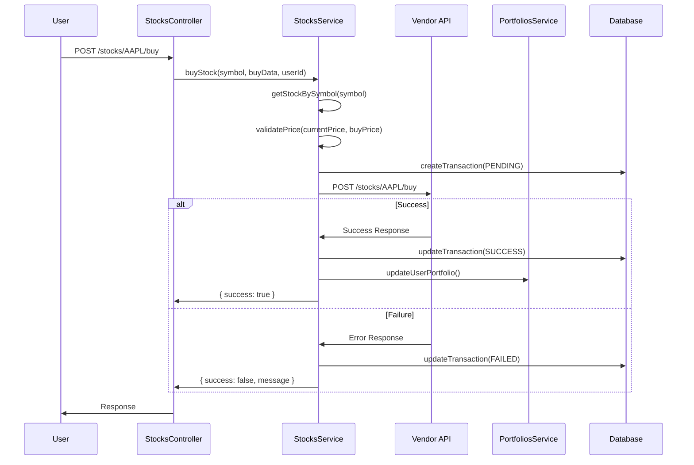
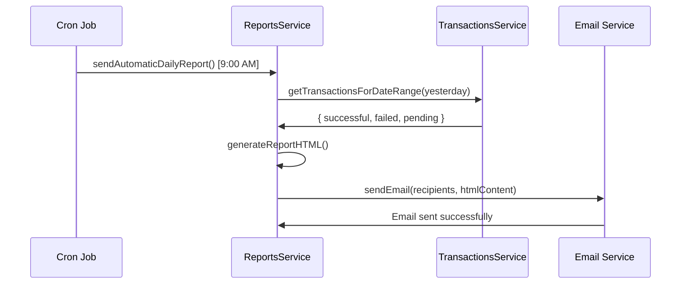

# REPORT.md - Architecture and Technical Decisions

## 📋 Executive Summary

This document describes the architecture, technical decisions, and implementation considerations of the **Fuse Trading API**, an enterprise-ready backend service for stock trading operations.

## 🎯 Requirements Compliance

### ✅ Implemented Functional Requirements

1. **✅ Stock listing endpoint** (`GET /stocks`)
   - Vendor API integration with pagination
   - Local cache updated every 5 minutes
   - Retry logic to handle unreliable API

2. **✅ User portfolios endpoint** (`GET /portfolios`) 
   - Complete portfolio management per user
   - Real-time profit/loss calculation
   - Aggregated performance statistics

3. **✅ Stock purchase endpoint** (`POST /stocks/:symbol/buy`)
   - Price validation with ±2% tolerance
   - Transaction management with states (PENDING/SUCCESS/FAILED)
   - Automatic portfolio updates

4. **✅ Daily email reporting system**
   - Automatic cron job at 9:00 AM
   - HTML and plain text emails
   - Complete statistics of successful and failed transactions

## 🏗️ Solution Architecture

### Technology Stack

**Backend Framework:**
- **NestJS**: Enterprise framework with modular architecture, dependency injection and decorators
- **TypeScript**: Static typing for better maintainability and development

**Database:**
- **PostgreSQL**: Robust database for ACID transactions
- **Prisma ORM**: Type-safe database access with automatic migrations

**Communication:**
- **Axios**: HTTP client with interceptors and retry logic
- **@nestjs/axios**: Native NestJS integration

**Validation and Serialization:**
- **class-validator**: Declarative validation with decorators
- **class-transformer**: Automatic object transformation

**Task Scheduling:**
- **@nestjs/schedule**: Native NestJS cron jobs
- **Nodemailer**: Email sending with HTML templates

**Logging and Monitoring:**
- **Winston**: Structured logging with multiple transports
- **nest-winston**: Native NestJS integration

**Containerization:**
- **Docker**: Containerization for development and production
- **Docker Compose**: Service orchestration

### Modular Architecture

```
src/
├── modules/                    # Business modules
│   ├── stocks/                # Stock management and vendor API
│   │   ├── stocks.controller.ts
│   │   ├── stocks.service.ts
│   │   ├── stocks.module.ts
│   │   └── dto/stock.dto.ts
│   ├── portfolios/            # Portfolio management
│   │   ├── portfolios.controller.ts
│   │   ├── portfolios.service.ts
│   │   ├── portfolios.module.ts
│   │   └── dto/portfolio.dto.ts
│   ├── transactions/          # Transaction management
│   │   ├── transactions.controller.ts
│   │   ├── transactions.service.ts
│   │   ├── transactions.module.ts
│   │   └── dto/transaction.dto.ts
│   └── reports/              # Reports and emails
│       ├── reports.controller.ts
│       ├── reports.service.ts
│       ├── reports.module.ts
│       └── dto/report.dto.ts
├── common/                   # Cross-cutting components
│   ├── dto/                 # Shared DTOs
│   ├── filters/            # Exception filters
│   └── interceptors/       # Request/Response interceptors
├── config/                 # Centralized configuration
│   └── configuration.ts
├── database/              # Database configuration
│   ├── database.module.ts
│   └── prisma.service.ts
└── main.ts               # Application entry point
```

## 🔧 Key Technical Decisions

### 1. **Choosing NestJS over Express**

**Decision:** Use NestJS instead of pure Express.js

**Justification:**
- ✅ **Enterprise architecture**: Modules, dependency injection, decorators
- ✅ **Native TypeScript**: Better developer experience and type safety
- ✅ **Scalability**: Clear structure for large teams
- ✅ **Robust ecosystem**: Native integration with Prisma, Winston, Scheduling
- ✅ **Testing**: Integrated testing framework with mocking

### 2. **PostgreSQL + Prisma ORM**

**Decision:** PostgreSQL with Prisma instead of MongoDB or TypeORM

**Justification:**
- ✅ **ACID compliance**: Critical for financial transactions
- ✅ **Type safety**: Prisma generates types automatically
- ✅ **Migrations**: Database version control
- ✅ **Performance**: Optimized queries and connection pooling
- ✅ **Development**: Prisma Studio for debugging

### 3. **Modular Microservices Architecture**

**Decision:** Modular monolith with clear separation of responsibilities

**Justification:**
- ✅ **Initial simplicity**: Lower operational complexity
- ✅ **Synchronous communication**: ACID transactions between modules
- ✅ **Rapid development**: Simpler deployment and debugging
- ✅ **Easy migration**: Modules can be extracted to microservices later

### 4. **Retry Logic and Circuit Breaker Pattern**

**Decision:** Implement retry logic with exponential backoff

**Justification:**
- ✅ **Resilience**: Vendor API is not 100% reliable
- ✅ **User experience**: Reduce false negatives in transactions
- ✅ **Configurability**: Number of retries and delays are configurable

```typescript
this.httpService.get(url).pipe(
  retry({
    count: this.vendorConfig.retryAttempts,
    delay: this.vendorConfig.retryDelay,
  }),
  catchError((error) => {
    // Handle graceful degradation
  }),
)
```

### 5. **Cache Strategy for Stocks**

**Decision:** Local cache with 5-minute TTL

**Justification:**
- ✅ **Performance**: Reduce calls to vendor API
- ✅ **Resilience**: Function even if vendor API temporarily fails
- ✅ **Consistency**: Prices updated every 5 minutes (per requirement)

```typescript
const fiveMinutesAgo = new Date(Date.now() - 5 * 60 * 1000);
if (!stock || stock.lastUpdated < fiveMinutesAgo) {
  // Fetch fresh data from vendor
}
```

### 6. **Email Templates and Cron Jobs**

**Decision:** HTML emails with plain text fallback + native cron jobs

**Justification:**
- ✅ **Professional appearance**: HTML emails with styling
- ✅ **Accessibility**: Plain text as fallback
- ✅ **Reliability**: Cron jobs integrated in NestJS
- ✅ **Configurability**: Schedules and recipients are configurable

## 🗃️ Data Model

### Main Entities

```sql
-- Users
users (
  id: CUID,
  email: String UNIQUE,
  name: String,
  created_at: DateTime,
  updated_at: DateTime
)

-- Stocks
stocks (
  id: CUID,
  symbol: String UNIQUE,
  name: String,
  price: Float,
  last_updated: DateTime
)

-- Portfolios
portfolios (
  id: CUID,
  user_id: String FK,
  name: String DEFAULT 'Default Portfolio',
  created_at: DateTime,
  updated_at: DateTime
)

-- Portfolio Positions
portfolio_stocks (
  id: CUID,
  portfolio_id: String FK,
  stock_id: String FK,
  quantity: Int,
  average_price: Float,
  created_at: DateTime,
  updated_at: DateTime,
  UNIQUE(portfolio_id, stock_id)
)

-- Transactions
transactions (
  id: CUID,
  user_id: String FK,
  stock_id: String FK,
  type: Enum(BUY, SELL),
  quantity: Int,
  price: Float,
  total: Float,
  status: Enum(PENDING, SUCCESS, FAILED),
  error_message: String?,
  created_at: DateTime,
  processed_at: DateTime?
)
```

### Relationships
- `users` 1:N `portfolios` 1:N `portfolio_stocks` N:1 `stocks`
- `users` 1:N `transactions` N:1 `stocks`

## 🔄 Business Flows

### Stock Purchase Flow



### Daily Report Flow



## 🛡️ Security and Validation

### Data Validation
- **class-validator**: Declarative validation in DTOs
- **class-transformer**: Automatic type transformation
- **Global Validation Pipe**: Automatic validation on all endpoints

```typescript
export class BuyStockDto {
  @IsNumber()
  @IsPositive()
  price: number;

  @IsNumber()
  @IsPositive()
  quantity: number;
}
```

### Error Handling
- **Global Exception Filter**: Captures and formats errors consistently
- **Structured logging**: All errors are logged with context
- **HTTP status codes**: Consistent responses with REST standards

### Security Considerations

**Implemented:**
- ✅ Robust input validation
- ✅ Logging of all transactions
- ✅ Global exception handling
- ✅ Environment variables for secrets

**For Production (not implemented in this demo):**
- 🔲 JWT authentication
- 🔲 Rate limiting
- 🔲 HTTPS/SSL
- 🔲 API key authentication
- 🔲 Input sanitization
- 🔲 SQL injection protection (handled by Prisma)

## 📊 Monitoring and Observability

### Logging
```typescript
// Structured logging with Winston
this.logger.log(`User ${userId} attempting to buy ${quantity} shares of ${symbol}`);
this.logger.error(`Vendor API error: ${error.message}`, error.stack);
```

### Health Checks
- **Health check endpoint**: `/api/v1` responds 200 if healthy
- **Database connection**: Prisma handles automatic reconnection
- **Docker health check**: Container monitoring

### Metrics (Recommended for production)
- Response times per endpoint
- Error rates per service
- Vendor API availability
- Database connection pool status
- Email delivery rates

## 🚀 Deployment and DevOps

### Containerization
```dockerfile
# Multi-stage build for optimization
FROM node:20-alpine AS builder
# Build stage...

FROM node:20-alpine AS production
# Production stage with non-root user
```

### Environment Configuration
```env
# Clear separation between development, staging and production
NODE_ENV=production
DATABASE_URL=postgresql://...
VENDOR_API_KEY=...
SMTP_CONFIGURATION=...
```

### CI/CD (Recommended)
```yaml
# GitHub Actions / GitLab CI
- name: Build and Test
  run: |
    npm ci
    npm run build
    npm run test
    npm run test:e2e

- name: Deploy to Production
  run: |
    docker build -t fuse-api .
    docker push registry/fuse-api:latest
```

## 🎯 Performance and Scalability

### Implemented Optimizations
- **Connection pooling**: Prisma handles connection pool
- **Lazy loading**: Relationships loaded only when needed
- **Indexing**: Indexes on frequently queried fields
- **Caching**: Local stock cache with TTL

### Optimizations for Production
- **Redis caching**: Distributed cache for multiple instances
- **Database read replicas**: Separate reads from writes
- **API rate limiting**: Protect against abuse
- **CDN**: For static assets
- **Load balancing**: Multiple app instances

## 🧪 Testing Strategy

### Testing Levels
```typescript
// Unit Tests
describe('StocksService', () => {
  it('should validate price within 2% tolerance', () => {
    // Test logic
  });
});

// Integration Tests
describe('StocksController (e2e)', () => {
  it('/stocks (GET)', () => {
    return request(app.getHttpServer())
      .get('/stocks')
      .expect(200);
  });
});
```

### Test Coverage Targets
- **Unit tests**: >80% coverage
- **Integration tests**: Critical user journeys
- **E2E tests**: Happy path scenarios

## 📈 Success Metrics

### Performance Targets
- **Response time**: <500ms p95 for critical endpoints
- **Availability**: >99.9% uptime
- **Error rate**: <0.1% for purchase transactions

### Business Metrics
- **Transaction success rate**: >98%
- **Daily report delivery**: 100% success rate
- **Vendor API retry effectiveness**: <5% final failure rate

## 📝 Conclusions

The implemented solution meets all functional requirements and establishes a solid foundation for an enterprise trading system. Technical decisions prioritize:

1. **Robustness**: Error handling, retry logic, ACID transactions
2. **Scalability**: Modular architecture easy to scale
3. **Maintainability**: Clean, documented and well-structured code
4. **Production-readiness**: Logging, monitoring, containerization

The system is ready to be deployed to production with minimal security and infrastructure configuration adjustments.
